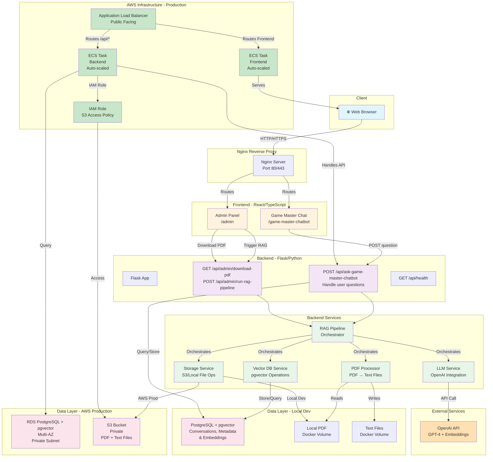
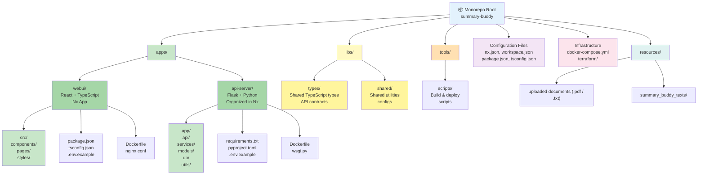

# Summary Buddy Chatbot - System Architecture

## System Architecture Diagram



## Nx Monorepo Structure Diagram



## Monorepo Organization

### **apps/** - Nx Applications
Contains the main frontend and backend applications managed by Nx:

#### **webui/**
- React + TypeScript application
- Built and served by Nx
- Dependencies managed in root `package.json`
- Contains all UI components and pages

#### **api-server/**
- Flask + Python application
- Organized under Nx workspace structure (non-npm)
- Dependencies in `requirements.txt`
- Python package structured as `app/` module

### **libs/** - Shared Code
Reusable code and configurations:

#### **types/**
- TypeScript type definitions
- Shared API contracts between frontend and backend
- Request/response schemas

#### **shared/**
- Common utilities
- Configuration templates
- Helper functions

### **tools/** - Build & Deployment Scripts
- Custom build scripts
- Docker build helpers
- Deployment automation

### **Configuration Files**
- **nx.json**: Nx workspace configuration
- **workspace.json**: Project definitions
- **package.json**: Root monorepo dependencies and scripts
- **tsconfig.json**: Root TypeScript configuration

### **Infrastructure & Resources**
- **docker-compose.yml**: Local development orchestration
- **terraform/**: AWS infrastructure as code
- **resources/**: PDF and extracted text files

## Nx CLI Commands

```bash
# Development
nx serve frontend                    # Start React dev server
nx build frontend                    # Build React app
nx lint frontend                     # Lint frontend code
nx test frontend                     # Test frontend

# Viewing project graph
nx graph                             # Visualize monorepo dependencies
nx affected:graph --base=main        # Show affected projects

# Backend commands (custom)
nx run backend:lint                  # Custom Python linting
nx run backend:test                  # Custom Python tests
```

## Architecture Components

### Frontend Layer
- **React + TypeScript**: Type-safe UI components
- **Game Master Chat** (`/game-master-chatbot`): Main chat interface
- **Admin Panel** (`/admin`): Administrative controls

### API Layer (Flask Backend)
- **POST /api/ask-game-master-chatbot**: Submit questions and receive RAG-enhanced answers
- **GET /api/admin/download-pdf**: Download an uploaded document
- **POST /api/admin/run-rag-pipeline**: Trigger PDF processing and vector DB creation
- **GET /api/health**: Health check endpoint

### Backend Services

#### RAG Pipeline Orchestrator
Coordinates the entire retrieval-augmented generation workflow:
- PDF processing
- Text chunking and embedding
- Vector database operations
- LLM query handling

#### PDF Processor Service
- Extracts text from PDF using `pypdf`
- Generates individual page text files
- Stores texts in local Docker volume (dev) or S3 (prod)

#### Vector DB Service
- Creates embeddings using OpenAI's text-embedding-3-large
- Manages the pgvector vector store inside PostgreSQL
- Handles similarity search queries

#### LLM Service
- Integrates with OpenAI GPT-4
- Generates context-aware responses
- Manages conversation context

#### Storage Service
- **Local Development**: Reads/writes to Docker volumes
- **AWS Production**: Interfaces with private S3 bucket

### Data Layer

#### Local Development
- **PostgreSQL + pgvector**: Conversation history, metadata, and embeddings
- **PDF & Text Files**: Stored on Docker volumes

#### AWS Production
- **RDS PostgreSQL**: Multi-AZ for high availability
- **S3 Bucket**: Private bucket with strict IAM policies
  - Backend IAM role has exclusive access
  - Public access blocked
  - Versioning enabled for recovery

### External Services
- **OpenAI API**: GPT-4 chat completions and embeddings

### AWS Infrastructure (Production)
- **ALB**: Routes traffic to frontend and backend services
- **ECS Fargate Tasks**: Auto-scaled containerized services
- **IAM Role**: Backend service has scoped permissions for S3

## Data Flow

### Chat Request Flow
1. User enters question in Game Master Chat
2. Frontend sends POST to `/api/ask-game-master-chatbot`
3. Backend RAG pipeline retrieves similar documents from pgvector
4. LLM generates answer with retrieved context
5. Backend stores conversation in PostgreSQL
6. Response returned to frontend

### RAG Pipeline Initialization
1. Admin clicks "Run RAG Pipeline"
2. Backend checks S3/local storage for PDF
3. PDF Processor extracts text pages
4. Text splitter chunks content
5. Embeddings generated via OpenAI
6. pgvector tables in PostgreSQL created/updated
7. Status returned to admin

## Security Considerations

- **S3 Bucket**: Private with bucket policies blocking public access
- **IAM Policies**: Backend service has scoped, least-privilege permissions
- **VPC**: All AWS resources in private subnets except ALB
- **Environment Variables**: Sensitive credentials in AWS Secrets Manager
- **Database**: RDS in private subnet, no public endpoint

## Deployment Environments

### Local Development
```bash
docker-compose up -d
# All services run locally with Docker volumes
```

### AWS Production
```bash
terraform apply
# Infrastructure provisioned: ECS, RDS, S3, ALB, VPC
```
