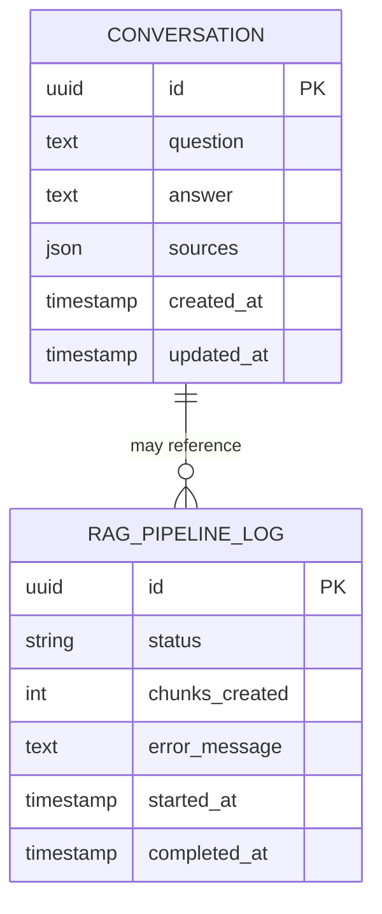

# Database Schema Diagram

## Entity Relationship Diagram



## Table Relationships

### Conversations Table
- **Purpose**: Store all user-AI interactions
- **Primary Key**: `id` (UUID)
- **Indexes**: `created_at` (for chronological queries)
- **Growth**: ~1KB per conversation (avg)

### RAG Pipeline Logs Table
- **Purpose**: Track PDF processing and vector DB creation
- **Primary Key**: `id` (UUID)
- **Indexes**: `status`, `started_at` (for filtering and analysis)
- **Growth**: ~200B per pipeline execution

## Typical Queries

### Get Recent Conversations
```sql
SELECT * FROM conversations 
ORDER BY created_at DESC 
LIMIT 10;
```

### Get RAG Pipeline Status
```sql
SELECT * FROM rag_pipeline_logs 
WHERE status = 'completed' 
ORDER BY completed_at DESC 
LIMIT 1;
```

### Search Conversations by Keyword
```sql
SELECT * FROM conversations 
WHERE question ILIKE '%Kaladin%' 
ORDER BY created_at DESC;
```

### Pipeline Execution Time
```sql
SELECT 
    status,
    COUNT(*) as count,
    AVG(EXTRACT(EPOCH FROM (completed_at - started_at))) as avg_duration_sec
FROM rag_pipeline_logs 
GROUP BY status;
```

## Scalability Notes

### Current Design
- No explicit relationships between tables
- UUID primary keys for distributed system readiness
- JSON for flexible source metadata

### Future Considerations
- Add foreign key: `RAGPipelineLog` → `Conversation` for traceability
- Partition `conversations` by month for archival
- Add `user_id` to support multiple users
- Add `rag_pipeline_id` to conversations to track which data was used
